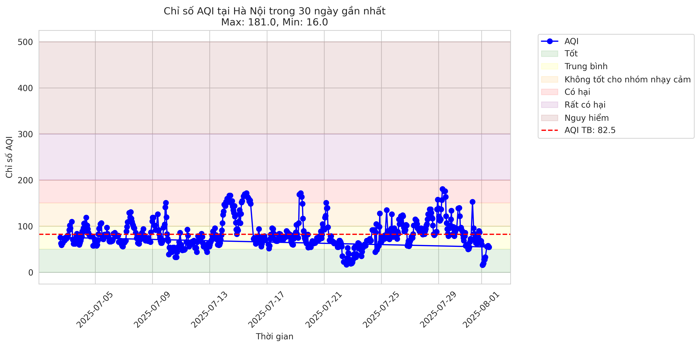
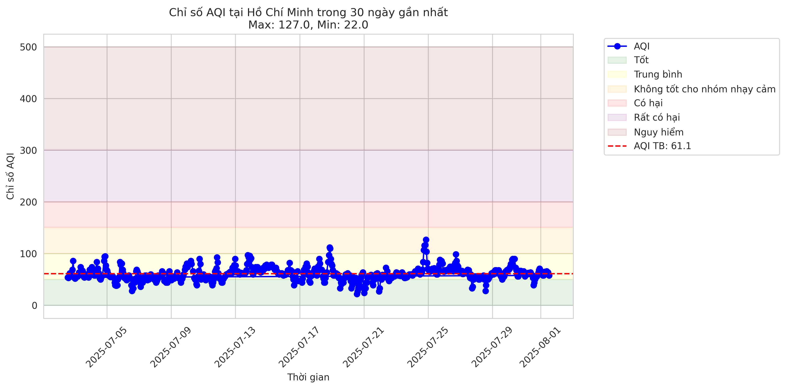
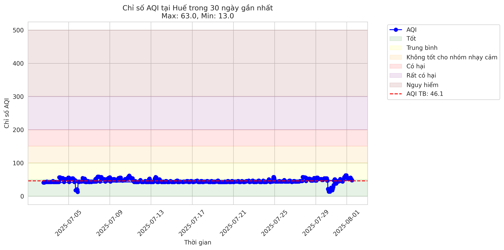
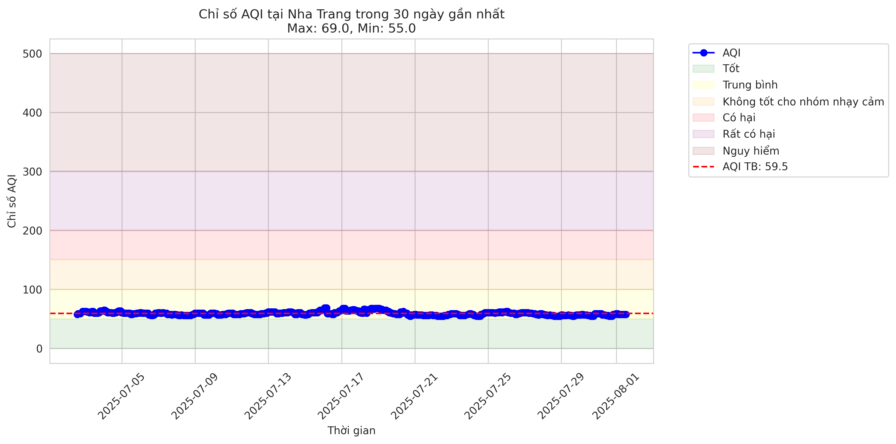
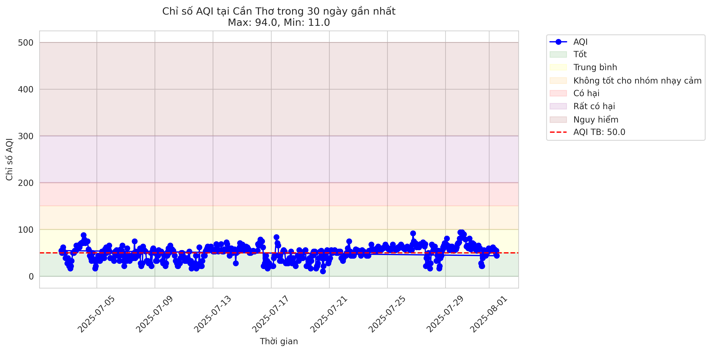
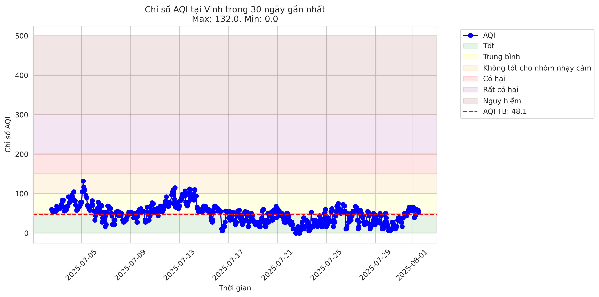

# Dự Án Thu Thập Dữ Liệu Chất Lượng Không Khí

## Giới thiệu

Hiện nay, nhiều thành phố ở Việt Nam đang phải đối mặt với vấn đề ô nhiễm không khí nghiêm trọng, đặc biệt là tại các thành phố lớn như Hà Nội. Tuy nhiên, chúng ta vẫn thiếu một bộ dữ liệu công khai và minh bạch để các nhà khoa học, nhà nghiên cứu môi trường có thể phân tích và tìm ra nguyên nhân cũng như giải pháp cho vấn đề này.

Dự án này được tạo ra với mục đích cung cấp một bộ dữ liệu thô về chất lượng không khí, phục vụ cho công tác nghiên cứu và phân tích. Từ đó, chúng ta có thể hiểu rõ hơn về các yếu tố ảnh hưởng đến chất lượng không khí và đưa ra những giải pháp phù hợp.

## Công nghệ sử dụng

- GitHub Actions: Tự động hóa việc thu thập dữ liệu, đảm bảo tính minh bạch và có thể theo dõi lịch sử thay đổi
- Python: Ngôn ngữ lập trình chính được sử dụng để crawl dữ liệu
- CSV: Định dạng lưu trữ dữ liệu

## Cấu trúc dữ liệu

Dữ liệu được lưu trữ trong các file CSV, được cập nhật định kỳ. Bạn có thể tìm thấy dữ liệu tại thư mục `result/`.

## Nguyên lý hoạt động

Dự án sử dụng bot tự động để thu thập dữ liệu từ trang web iqair.com với chu kỳ 1 giờ/lần. Các thông tin được thu thập bao gồm:
- Thời gian đo
- Tên thành phố
- Chỉ số chất lượng không khí (AQI)
- Điều kiện thời tiết
- Tốc độ gió
- Độ ẩm

### Cấu trúc dữ liệu chi tiết

Dữ liệu được tổ chức theo cấu trúc thư mục:
```
result/
├── ha-noi/
│   ├── aqi_ha-noi_2025_jan.csv
│   ├── aqi_ha-noi_2025_feb.csv
│   └── ...
├── da-nang/
│   ├── aqi_da-nang_2025_jan.csv
│   └── ...
└── ho-chi-minh/
    ├── aqi_ho-chi-minh_2025_jan.csv
    └── ...
```

Mỗi file CSV chứa các cột dữ liệu:
- `timestamp`: Thời gian lấy dữ liệu
- `city`: Tên thành phố
- `aqi`: Chỉ số chất lượng không khí
- `weather`: Điều kiện thời tiết
- `wind_speed`: Tốc độ gió
- `humidity`: Độ ẩm

## Hướng dẫn sử dụng

1. Clone repository này về máy:
```bash
git clone https://github.com/nghiahsgs/iqair-dataset.git
```

2. Dữ liệu thô được lưu trong thư mục `result/` dưới định dạng CSV
3. Bạn có thể sử dụng các công cụ như Power BI, Python, R để phân tích và trực quan hóa dữ liệu

## Hướng dẫn cài đặt và chạy dự án

### Yêu cầu hệ thống
- Python 3.8 trở lên
- pip (Python package installer)
- Chromium browser (sẽ được cài đặt tự động)

### Các bước cài đặt

1. Clone repository về máy:
```bash
git clone https://github.com/nghiahsgs/iqair-dataset.git
cd iqair-dataset
```

2. Cài đặt các thư viện cần thiết:
```bash
pip install -r requirements.txt
```

3. Cài đặt Chromium cho Playwright:
```bash
playwright install chromium
```

### Chạy dự án

1. Chạy script crawl dữ liệu:
```bash
python crawl_iqair.py
```

2. Dữ liệu sau khi crawl sẽ được lưu vào thư mục `result/` dưới dạng file CSV

### Lưu ý
- Script được thiết kế để chạy tự động mỗi giờ thông qua GitHub Actions
- Bạn có thể tùy chỉnh tần suất cập nhật trong file `.github/workflows/crawl.yml`
- Đảm bảo bạn có đủ quyền truy cập internet để script có thể lấy dữ liệu

## Tần suất cập nhật

Dữ liệu được cập nhật tự động mỗi giờ thông qua GitHub Actions, đảm bảo tính liên tục và độ tin cậy của dữ liệu.

## Gợi ý sử dụng

- Phân tích mối tương quan giữa thời gian trong ngày và chất lượng không khí
- So sánh chất lượng không khí giữa các khu vực khác nhau
- Nghiên cứu ảnh hưởng của các yếu tố như giao thông, thời tiết đến chất lượng không khí
- Sử dụng Power BI hoặc các công cụ trực quan hóa khác để tạo dashboard theo dõi chất lượng không khí

## Miễn trừ trách nhiệm

Dự án này chỉ thu thập và cung cấp dữ liệu thô từ nguồn thứ ba. Chúng tôi không chịu trách nhiệm về độ chính xác của dữ liệu. Mục đích của dự án là phục vụ cho nghiên cứu khoa học và không đưa ra bất kỳ nhận định hay kết luận nào về nguyên nhân ô nhiễm không khí.

## Đóng góp

Đây là một dự án mã nguồn mở vì cộng đồng. Mọi đóng góp đều được hoan nghênh. Vui lòng tạo pull request hoặc issue nếu bạn muốn cải thiện dự án.

## Vì 1 tương lai xanh <3

## Biểu đồ chất lượng không khí trong 30 ngày gần nhất

### Ha Noi
<!-- HANOI_CHART_START -->

<!-- HANOI_CHART_END -->

### Ho Chi Minh
<!-- HCMC_CHART_START -->

<!-- HCMC_CHART_END -->

### Da Nang
<!-- DANANG_CHART_START -->

<!-- DANANG_CHART_END -->

### Hue
<!-- HUE_CHART_START -->

<!-- HUE_CHART_END -->

### Nha Trang
<!-- NHATRANG_CHART_START -->

<!-- NHATRANG_CHART_END -->

### Can Tho
<!-- CANTHO_CHART_START -->

<!-- CANTHO_CHART_END -->

### Hai Phong
<!-- HAIPHONG_CHART_START -->

<!-- HAIPHONG_CHART_END -->

### Vinh
<!-- VINH_CHART_START -->

<!-- VINH_CHART_END -->
